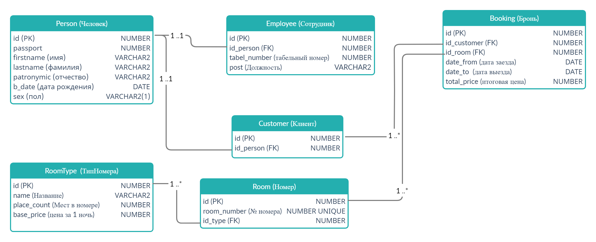

# АС "Гостиница"
## Студент: Белоусов Андрей
### База данных: Oracle PL/SQL

### Схема БД

Система позволяет добавлять/изменять данные о сотрудниках, номерах гостиницы, типов номеров и брони.
Для бронирования номера нужно указать его тип, дату заезда и дату выезда, а также персональные данные.
Система самостоятельно выберет и забронирует свободный номер указанного типа, а также добавит данные о клиенте.
Подробности реализации смотреть в директории api.

Порядок выполнения скриптов:
1. create_schema.sql
2. все скрипты из /api
3. mocks.sql
